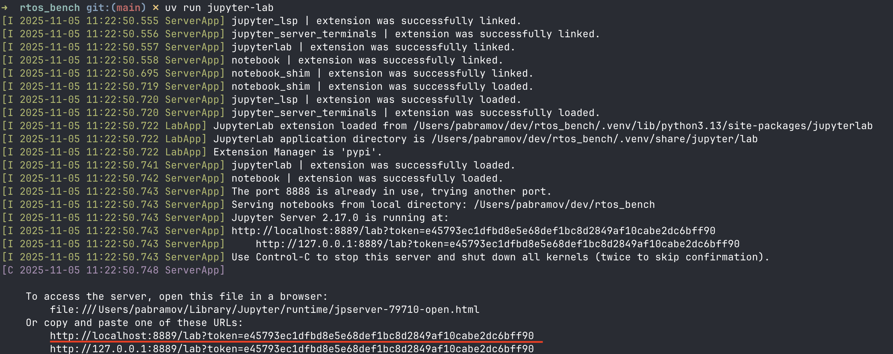
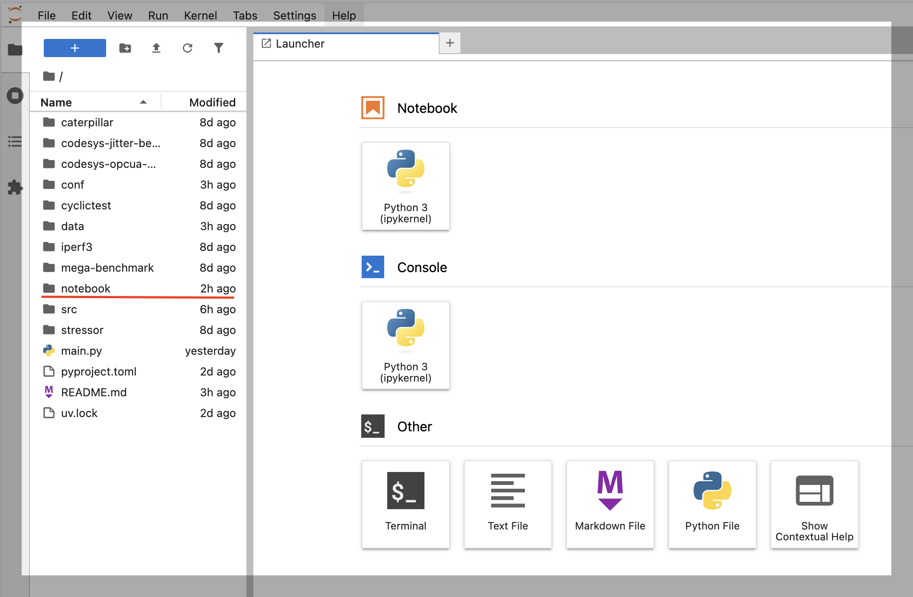
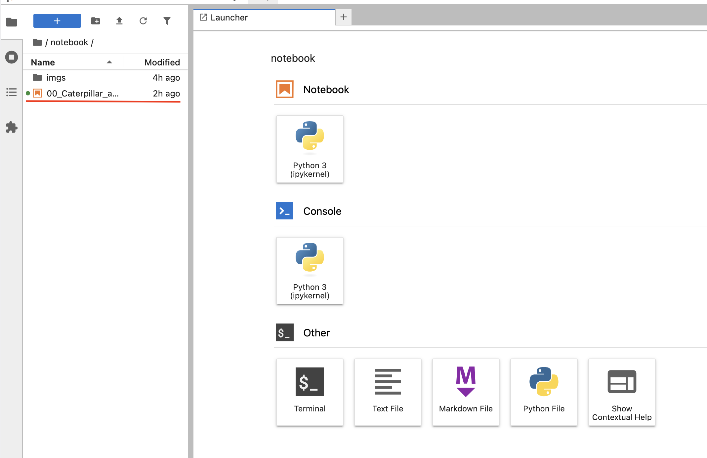

# rtos_bench: benchmarking suite to analyse real-time (RT) performance of an operating system

A comprehensive Python framework for benchmarking, analyzing and validating real-time (RT) performance of operating systems. Combines Docker-containerized benchmarks with statistical analysis tools based on Extreme Value Theory (EVT) to determine if a system meets real-time requirements.

## Key Features

- **Containerized Benchmarks**: Run reproducible RT benchmarks (Caterpillar, Cyclictest, iperf3, CODESYS) in Docker or on your host system
- **Intel RDT Integration**: Full support for Cache Allocation Technology (CAT) and Memory Bandwidth Allocation (MBA)
- **Statistical RT Validation**: EVT-based analysis with Region of Acceptance (RoA) for probabilistic WCET estimation
- **BIOS Collection via Redfish**: Automatically capture BIOS settings from BMC/iDRAC before benchmarks
- **Jupyter Analysis Notebooks**: Interactive reports for analyzing benchmark results and RT readiness

## Prerequisites:

1. Install git-lfs [link](https://docs.github.com/en/repositories/working-with-files/managing-large-files/installing-git-large-file-storage)

2. Install uv package manager

```bash
curl -LsSf https://astral.sh/uv/install.sh | sh
```

3. Install packages needed for repository

```bash
uv sync
```

4. Additional system requirements:
   - Docker (for containerized execution)
   - `intel-cmt-cat` package (for pqos/Intel RDT support)
   - Root access (required for pqos, IRQ affinity, and some metrics)


## Quick Start

```bash

# Install dependencies and virtual environment (venv)
uv sync

# Build all Docker images first
sudo .venv/bin/python3 main.py run.command=build

# Run a benchmark (e.g. caterpillar)
sudo .venv/bin/python3 main.py run.command=caterpillar

# Analyze results in Jupyter
uv run jupyter-lab
```

> **Note**: Benchmarks require root access for pqos, IRQ affinity configuration, and hardware monitoring. Use `sudo .venv/bin/python3/main.py` instead of `uv run main.py`

## How to run jupyter notebook (analysis software)

```
uv run jupyter-lab
```

It will prompt you to jupyter lab tab using your default browser, in case it won't you can find link to copy-paste in your
browser somewhere here



Then you should open notebooks tab, that's where all the notebooks are stored (analysis reports)



After that you can open any report and run it, just double-click on it like here




## Repository structure

```
.
├── conf/
│   └── config.yaml        # Hydra configuration file with experiment parameters
├── caterpillar/
├── cyclictest/
├── iperf3/
├── mega-benchmark/
├── codesys-jitter-benchmark/
├── outputs/ # Where we run experiment bundles 
├── notebooks/ # Jupyter notebooks to analyse data 
├── src/ # libraries 
│
├── main.py      # Main Python script to launch benchmarks
└── README.md

```

## Configuration

All experiment parameters are controlled via Hydra’s configuration file at:
```
conf/config.yaml
```

You can override any configuration parameter from the command line:

```bash
sudo .venv/bin/python3 main.py run.command=cyclictest run.t_core="3,5"
```

## Run Configuration

```yaml
run:
  command: "caterpillar"      # Benchmark to run
  t_core: "9,11"              # Target CPU cores
  numa_node: "1"              # NUMA node for cpuset-mems (should be same as NUMA node for t_core)
  stressor: true              # Enable stress workload
  metrics: true               # Enable metrics monitoring
  docker: true                # Run inside Docker container
  cat_clos_pinning:
    enable: true              # Pin test PID to CLOS
    clos: 1                   # CLOS ID to use
```

| Parameter                    | Type    | Description                                                                                                    |
| ---------------------------- | ------- | -------------------------------------------------------------------------------------------------------------- |
| `run.command`                | str     | Benchmark to run: `caterpillar`, `cyclictest`, `iperf3`, `mega-benchmark`, `codesys-jitter-benchmark`, `codesys-opcua-pubsub`, or `build`. |
| `run.t_core`                 | str     | Target CPU cores for running the benchmark (e.g., `"3,5,7,9"` or `"9,11"`)                                     |
| `run.numa_node`              | str     | NUMA node for cpuset-mems (should be same as NUMA node for t_core)                                                                            |
| `run.stressor`               | bool    | Enables additional stress workload during the benchmark                                                        |
| `run.metrics`                | bool    | Enable real-time metrics monitoring (CPU temp, IRQs, memory, etc.)                                             |
| `run.docker`                 | bool    | Run benchmark inside Docker container (if `false`, runs on host)                                               |
| `run.cat_clos_pinning.enable`| bool    | Enable pinning test PID to specified CLOS (caterpillar/cyclictest only)                                        |
| `run.cat_clos_pinning.clos`  | int     | CLOS ID to pin the test process to                                                                             |

## Intel RDT/CAT Configuration (pqos)

Configure Intel Resource Director Technology (Cache Allocation Technology, Memory Bandwidth Allocation):

```yaml
pqos:
  interface: "os"             # 'os' for resctrl (recommended), 'msr' for direct access
  reset_before_apply: true    # Reset all allocations before applying new ones

  classes:
    - id: 1
      description: "real-time workload"
      l3_mask: "0x00ff"       # L3 cache mask (8 cache ways)
      l2_mask: "0x00ff"       # L2 cache mask
      mba: 100                # Memory Bandwidth Allocation (%)
      pids: []                # PIDs to assign to this class
      cores: []               # CPU cores to assign to this class
    - id: 0
      description: "background worker"
      l3_mask: "0x7f00"       # Different cache ways for isolation
      l2_mask: "0xff00"
      mba: 10
      cores: [0,1,2,3,4,5,6,7,8,9,10,11,12,13,14,15]
      pids: [115, 118]
```

| Parameter                  | Type   | Description                                                        |
| -------------------------- | ------ | ------------------------------------------------------------------ |
| `pqos.interface`           | str    | Interface mode: `os` (resctrl, required for PIDs) or `msr` (direct)|
| `pqos.reset_before_apply`  | bool   | Reset all allocations before applying new configuration            |
| `pqos.classes[].id`        | int    | Class of Service (CLOS) ID                                         |
| `pqos.classes[].l3_mask`   | str    | Hexadecimal L3 cache way mask                                      |
| `pqos.classes[].l2_mask`   | str    | Hexadecimal L2 cache way mask                                      |
| `pqos.classes[].mba`       | int    | Memory Bandwidth Allocation percentage (10-100)                    |
| `pqos.classes[].cores`     | list   | CPU cores to assign to this CLOS leave empty if not used                                   |
| `pqos.classes[].pids`      | list   | Process IDs to assign to this CLOS leave empty if not used                                 |


## IRQ Affinity Configuration

Configure IRQ and RCU task affinity to isolate real-time cores:

```yaml
irq_affinity:
  enabled: true
  housekeeping_cores: "0-1"   # Cores for handling IRQs and RCU
```

## BIOS Settings Collection via Redfish

Automatically collect BIOS settings from servers with Redfish-enabled BMC (e.g., Dell iDRAC) before running benchmarks:

```yaml
bios:
  enable: true
  redfish:
    host: "192.168.1.100"     # BMC/iDRAC IP address
    username: "root"
    password: "YOUR_PASSWORD"
    verify_ssl: false         # Set to true for valid SSL certificates
    timeout: 15

  output:
    format: "json"            # Output format: json, yaml, or text
    file: "${hydra:run.dir}/bios.json"
    pretty: true
```

| Parameter                 | Type   | Description                                                        |
| ------------------------- | ------ | ------------------------------------------------------------------ |
| `bios.enable`             | bool   | Enable/disable BIOS settings collection                            |
| `bios.redfish.host`       | str    | BMC/iDRAC hostname or IP address                                   |
| `bios.redfish.username`   | str    | Username for Redfish API authentication                            |
| `bios.redfish.password`   | str    | Password for Redfish API authentication                            |
| `bios.redfish.verify_ssl` | bool   | Verify SSL certificates (set `false` for self-signed certs)        |
| `bios.redfish.timeout`    | int    | Connection timeout in seconds                                      |
| `bios.output.format`      | str    | Output format: `json`, `yaml`, or `text`                           |
| `bios.output.file`        | str    | Path to save BIOS settings (supports Hydra interpolation)          |
| `bios.output.pretty`      | bool   | Enable pretty-printing for JSON output                             |

## Test-Specific Configuration

### Caterpillar
```yaml
caterpillar:
  n_cycles: 7200              # Number of measurement cycles
```

### Cyclictest
```yaml
cyclictest:
  loops: 100000               # Number of test loops
```

## Metrics Monitoring

When `run.metrics: true`, the following monitors collect data during benchmark execution:

| Monitor          | Output File                    | Description                              |
| ---------------- | ------------------------------ | ---------------------------------------- |
| CPU Monitor      | `cpu_monitor.csv`              | Per-core CPU temperatures                |
| IRQ Monitor      | `irq_monitor.csv`              | Interrupt counts per CPU                 |
| MemInfo Monitor  | `meminfo_monitor.csv`          | Memory statistics from `/proc/meminfo`   |
| SoftIRQ Monitor  | `softirq_monitor.csv`          | Software interrupt statistics            |
| CPUStat Monitor  | `cpustat_monitor.csv`          | CPU usage statistics                     |
| PQOS Monitor     | `pqos_monitor.csv`             | Intel RDT monitoring data                |

Configure monitoring intervals in the config:

```yaml
cpu_monitor:
  path: "${hydra:run.dir}/cpu_monitor.csv"
  interval: 1.0
```

## Output Files

Each benchmark run creates a timestamped directory in `outputs/` containing:

- `output.csv` - Benchmark results
- `sysinfo.json` - System information snapshot (includes Hydra configuration)
- `bios.json` - BIOS settings (if enabled)
- `*_monitor.csv` - Various metrics logs (if enabled)
- `.hydra/` - Hydra configuration logs

## Security Note

⚠️ **Important**: The Redfish password is stored in the configuration file. Consider:
- Using environment variables for sensitive credentials
- Restricting file permissions on `config.yaml`
- Not committing passwords to version control

## References

- [Dealing with Uncertainty in pWCET Estimations](https://dl.acm.org/doi/abs/10.1145/3396234) - Region of Acceptance methodology
- [Probabilistic-WCET Reliability](https://dl.acm.org/doi/10.1145/3126495) - EVT hypothesis validation
